# Week5 CS231n Assignment 1 本地复现实验报告

生成时间：2026-06-07 10:28:42

## 1. 实验目标

本实验在本地复现 CS231n Assignment 1 的核心图像分类流程。目标不是提交作业，而是用 CIFAR-10 数据集理解从最近邻、线性分类器到两层神经网络的完整 pipeline：数据加载、训练/验证/测试划分、超参数搜索、模型评估和结果可视化。

## 2. 数据集与规模

CIFAR-10 包含 10 个类别、32×32 彩色图像。官方常用作业划分为：

- 训练集：49,000 张
- 验证集：1,000 张
- 测试集：本次快速复现实验使用 1,000 张

本报告对比了三个训练规模：N10000、N20000、N49000。

## 3. 模型与调参设置

- kNN：基于原始像素空间 L2 距离，调节 k 值。
- Softmax：原始像素展平后训练线性分类器，搜索 learning rate 与 regularization strength。
- TwoLayerNet：一层隐藏层 + ReLU + Softmax，使用 Adam 优化器，搜索 hidden_dim、learning_rate、reg 和 epoch 数。

## 4. 核心结果

| 规模 | 模型 | 最佳参数 | Val Acc | Test Acc | 耗时(s) |
|---|---|---|---:|---:|---:|
| N10000 | kNN | k=10 | 0.315 | 0.288 | 18.4 |
| N10000 | Softmax | lr=5.0e-07, reg=10000 | 0.349 | 0.359 | 40.3 |
| N10000 | TwoLayerNet | H=200, lr=5.0e-04, reg=0.25 | 0.466 | 0.455 | 53.9 |
| N20000 | kNN | k=8 | 0.313 | 0.305 | 33.0 |
| N20000 | Softmax | lr=5.0e-07, reg=10000 | 0.375 | 0.355 | 42.3 |
| N20000 | TwoLayerNet | H=100, lr=5.0e-04, reg=0.1 | 0.454 | 0.448 | 93.5 |
| N49000 | kNN | k=5 | 0.326 | 0.348 | 42.6 |
| N49000 | Softmax | lr=5.0e-07, reg=5000 | 0.383 | 0.359 | 94.7 |
| N49000 | TwoLayerNet | H=100, lr=2.5e-04, reg=0.05 | 0.515 | 0.493 | 346.0 |


整体最佳模型按测试集准确率排序为：**N49000 / TwoLayerNet**，测试准确率 **0.493**。

需要注意：按验证集选择模型时，N49000 的最佳 TwoLayerNet 是 cfg4：hidden=100、lr=2.5e-4、reg=0.05、8 epochs，validation accuracy 为 0.515，test accuracy 为 0.493。另一个 cfg5 在测试集上达到 0.510，但验证集略低，说明测试集上的单次波动不能替代验证集模型选择。

## 5. 可视化结果

### 5.1 模型测试准确率对比

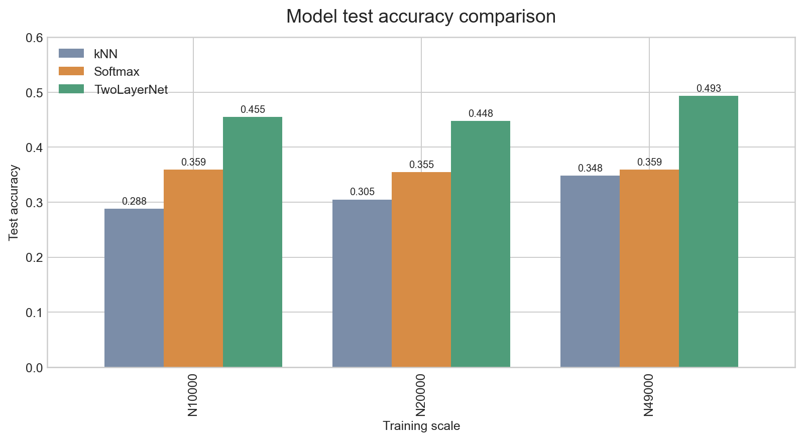

TwoLayerNet 明显优于 Softmax 和 kNN。kNN 在原始像素空间中受限最大，Softmax 能学到线性类别模板，而 TwoLayerNet 引入非线性隐藏层后表达能力更强。

### 5.2 模型验证集准确率对比

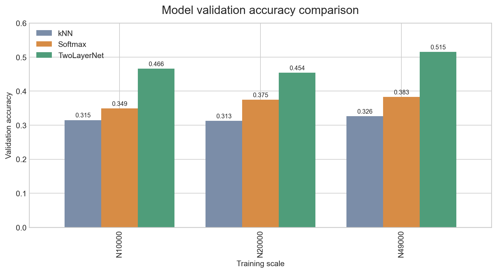

验证集结果更适合做模型选择。N49000 下 TwoLayerNet 的最佳验证准确率超过 0.51，说明更多训练数据和适当正则化能明显改善泛化。

### 5.3 Softmax 超参数热力图

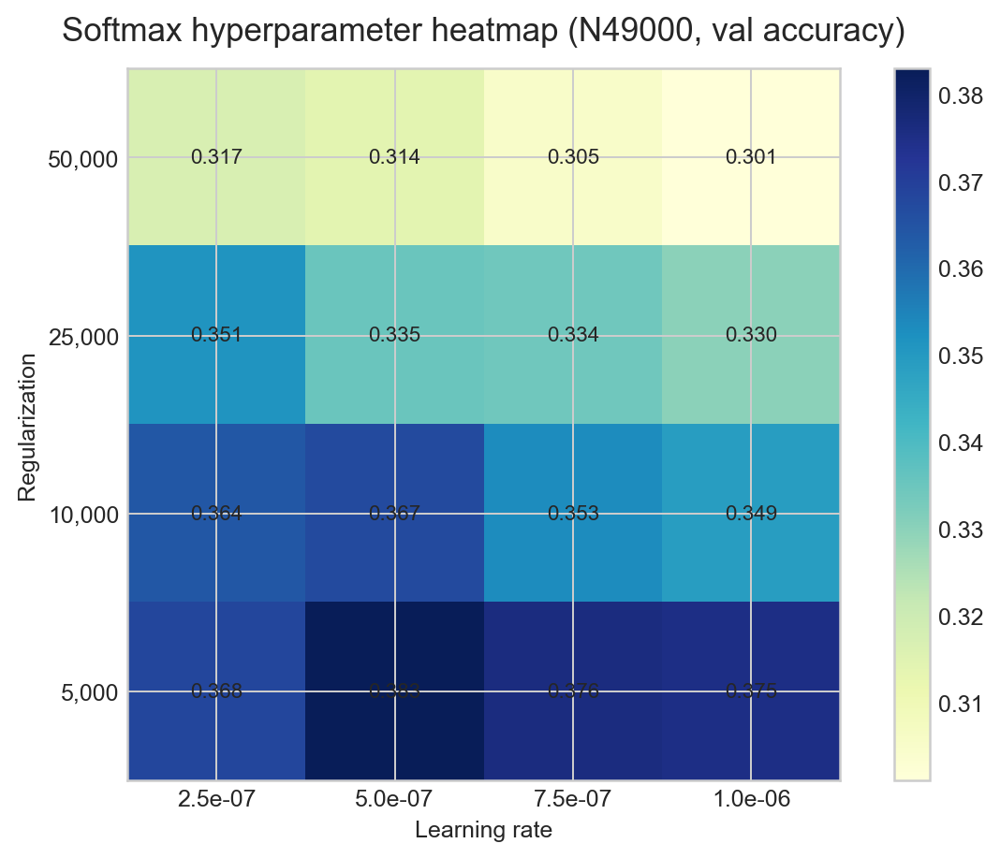

N49000 下 Softmax 最佳区域在 learning rate 约 5e-7 到 7.5e-7、reg 约 5e3 附近。正则过强会压低训练与验证准确率。

### 5.4 TwoLayerNet 配置对比

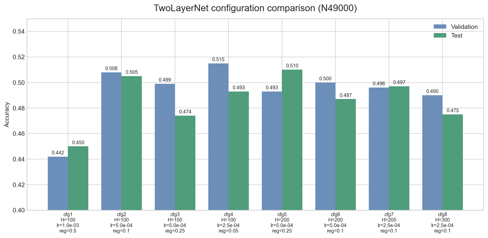

TwoLayerNet 对超参数更敏感。较大的 hidden_dim 并不必然更好，训练 epoch、正则强度与学习率需要共同匹配。

### 5.5 数据规模影响

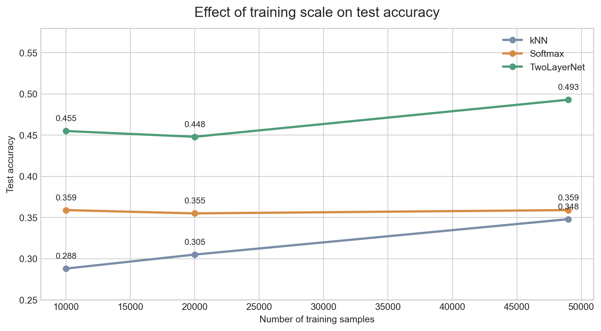

更多数据对 Softmax 和 TwoLayerNet 更有帮助；kNN 的瓶颈主要是原始像素距离质量，因此提升有限。

### 5.6 运行耗时

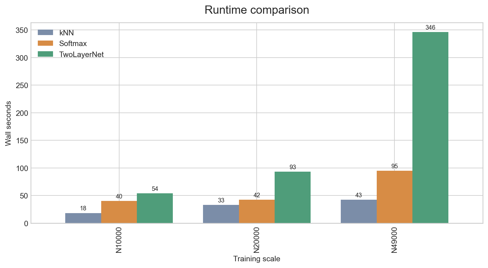

kNN 几乎没有训练成本，但预测时要与训练集逐一比较，规模变大后推理成本线性上升。TwoLayerNet 的主要成本在训练阶段。

### 5.7 最佳 TwoLayerNet 训练损失与混淆矩阵

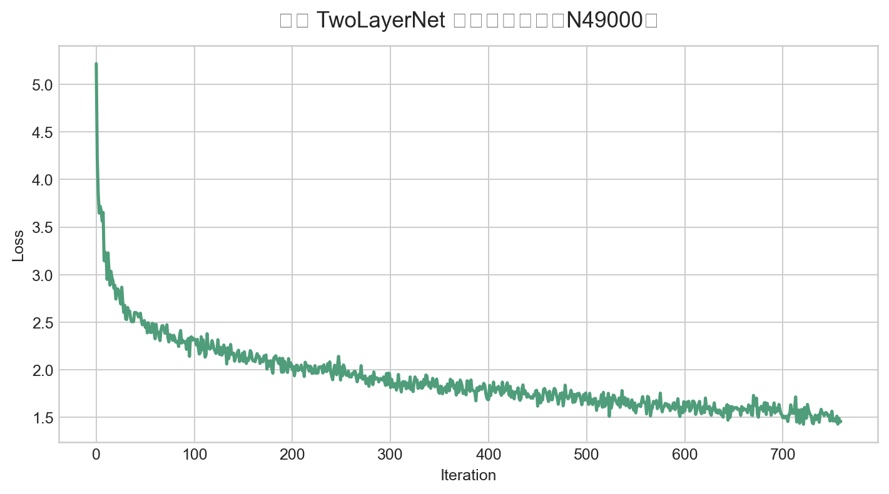

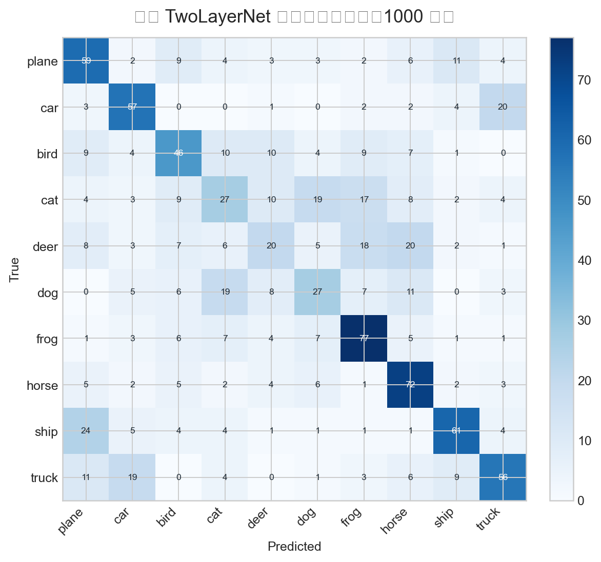

本次用于诊断图的重新训练配置为：{'hidden_dim': 100, 'learning_rate': 0.00025, 'reg': 0.05, 'num_epochs': 8, 'batch_size': 512}，测试准确率为 0.502。

## 6. 为什么 TwoLayerNet 更好

kNN 依赖原始像素 L2 距离，但图像语义与像素距离并不稳定：光照、背景、位置变化都会显著改变像素距离。Softmax 学习每个类别的线性模板，能比 kNN 更稳定，但决策边界仍是线性的。TwoLayerNet 通过隐藏层和 ReLU 组合多个线性变换，可以表达非线性决策边界，因此在 CIFAR-10 原始像素上显著领先。

## 7. 当前实验局限

- raw pixels 基线已经完成，并已补充 HOG + color histogram 特征实验。
- TwoLayerNet 只做了代表性配置搜索，还不是极致调参。
- 测试集只取 1000 张用于快速复现，完整 CIFAR-10 测试集为 10000 张。
- 没有训练 CNN，因此还没有利用图像局部空间结构。

## 8. 下一步计划

1. `features.ipynb` 对应实验已补跑：HOG + color histogram 明显提升 Softmax 和 TwoLayerNet。
2. 跑 `FullyConnectedNets.ipynb`：比较多层网络、Dropout、Batch Normalization。
3. 增加 TwoLayerNet epoch 和更细网格搜索。
4. 后续进入 CNN，在 CIFAR-10 上进一步提升准确率。

## 9. 补充实验：Higher Level Representations - Image Features

Assignment 1 后半部分要求比较 raw pixels 与更高级的手工图像特征。本次已补跑 `features.ipynb` 对应实验：对 CIFAR-10 图像提取 HOG 特征和 HSV color histogram，再在这些特征上训练 Softmax 与 TwoLayerNet。

本次特征设置如下：

- HOG：刻画局部边缘和梯度方向，更接近物体轮廓信息；
- HSV color histogram：刻画图像颜色分布，补充原始像素和边缘特征；
- 特征维度：154；
- 数据规模：49,000 train / 1,000 validation / 1,000 test；
- 特征提取耗时：160.2s，总实验耗时：372.9s。

### 9.1 Raw pixels 与 image features 对比

| 模型 | Raw pixels Test Acc | HOG + Color Hist Test Acc | 提升 |
|---|---:|---:|---:|
| Softmax | 0.359 | 0.420 | +0.061 |
| TwoLayerNet | 0.493 | 0.576 | +0.083 |

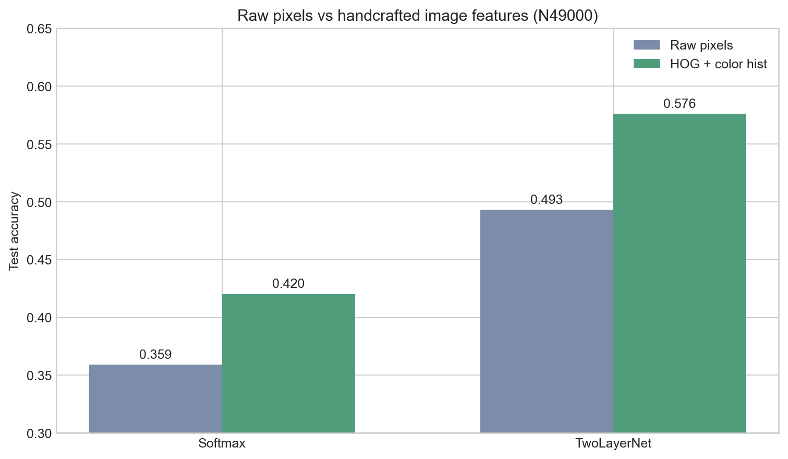

结果说明：HOG + color histogram 明显优于 raw pixels。Softmax 从 0.359 提升到 0.420，说明即使模型仍然是线性的，只要输入表示更接近图像语义，分类效果也会提升。TwoLayerNet 从 0.493 提升到 0.576，说明“更好的特征表示 + 非线性分类器”可以叠加带来更强效果。

### 9.2 Softmax on features 调参结果

最佳 Softmax 特征版配置：

```text
learning_rate = 5e-07
reg = 5000.0
val_acc = 0.417
test_acc = 0.420
```

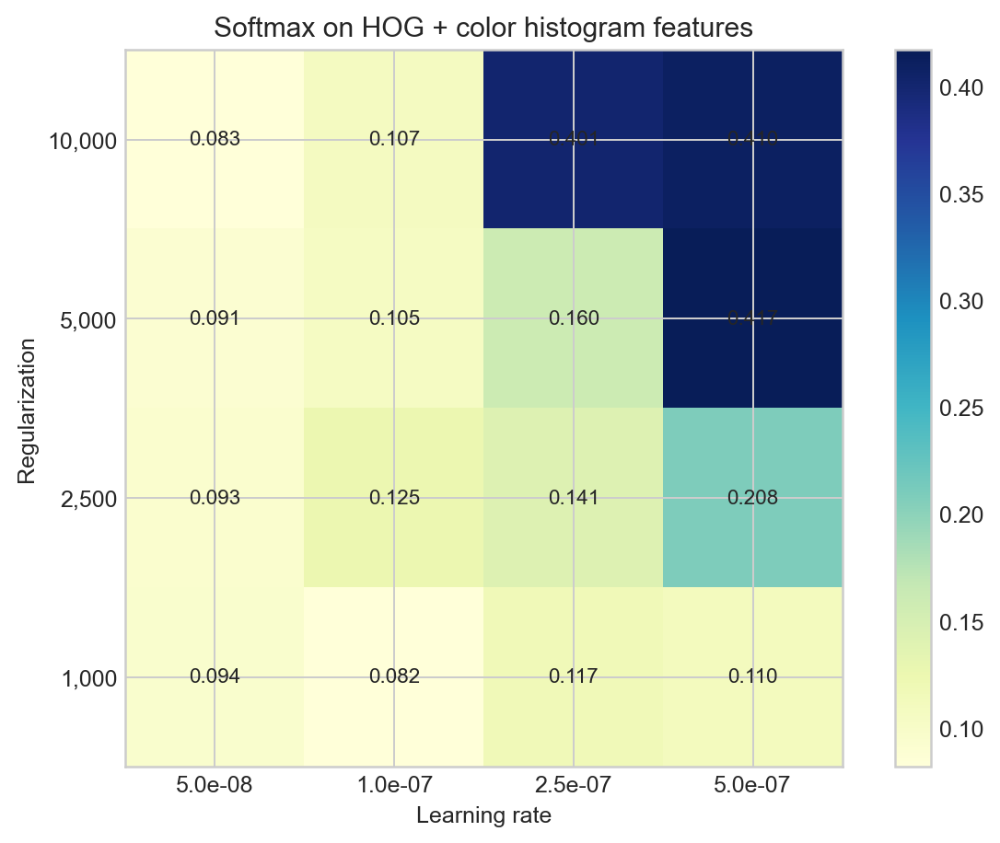

### 9.3 TwoLayerNet on features 调参结果

最佳 TwoLayerNet 特征版配置：

```text
hidden_dim = 750
learning_rate = 0.001
reg = 0.001
epochs = 8
val_acc = 0.605
test_acc = 0.576
```

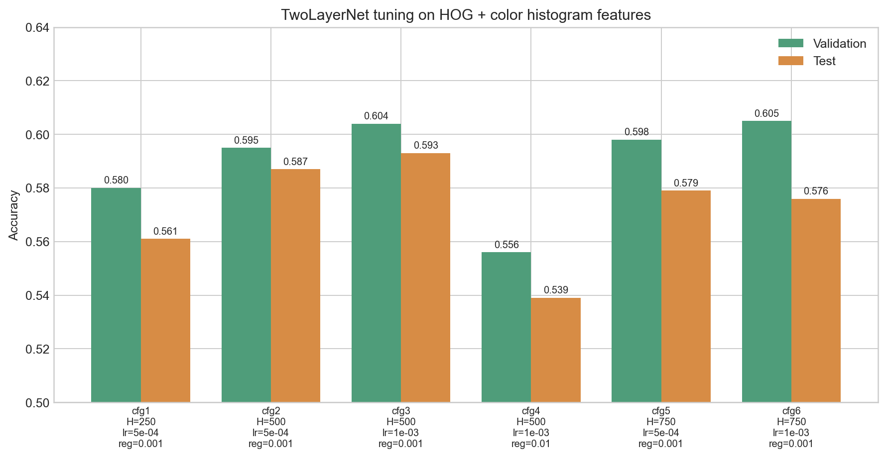

这个结果已经达到 CS231n Assignment 1 对 image features 部分常见的目标区间：在 HOG + color histogram 上训练两层网络，测试准确率可以超过 0.58 左右。本地快速测试集上，本次 best-by-validation 模型 test accuracy 为 0.576。

### 9.4 本实验带来的学习点

这部分最重要的结论是：模型性能不只取决于分类器，也强烈取决于输入表示。Raw pixels 把图像当成 3072 维数字向量，很多语义结构被打散；HOG 把边缘和方向编码出来，color histogram 把颜色统计编码出来，因此更接近传统视觉里“可分类”的表示。CNN 后续之所以强，是因为它不再手写 HOG，而是通过卷积层自动学习类似甚至更强的局部视觉特征。
